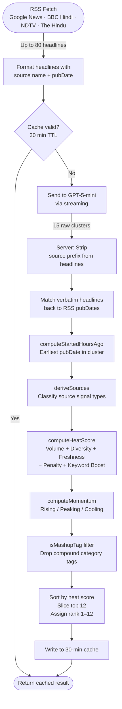

# Trends — Live Indian News Trending Tags

A mobile app that shows the top 12 trending topics in India right now, ranked by a deterministic heat score built entirely from live RSS feed data. No editorial curation. No hardcoded topics. Refreshes every 30 minutes.

---

## How the System Decides What's Trending

### Data Sources

Every refresh pulls headlines from four free, public RSS feeds:

| Feed | Why it's included |
|---|---|
| Google News India (Hindi) | Broadest coverage, aggregates hundreds of publishers |
| BBC Hindi | High editorial quality, trusted signal for real events |
| NDTV India | Fast-breaking news, strong domestic coverage |
| The Hindu (National) | Slower but authoritative, good for separating signal from noise |

Each feed contributes up to 20 headlines, giving the system up to 80 headlines per cycle. The overlap between feeds is intentional — a topic covered by multiple independent sources is more likely to be genuinely trending.

---

### The Heat Score Formula

Every candidate trend is scored on a 60–100 scale using four deterministic signals. No AI is involved in scoring.

```
Heat Score = Volume Score + Source Diversity Score + Freshness Score − Recency Penalty + Keyword Boost
           (clamped to 60–100)
```

**1. Volume Score (max 40 points)**
Each headline clustered under a topic adds 8 points, capped at 40.

> Rationale: More headlines = more editors independently deciding this story matters. 5 headlines is enough to max out this component (40 pts), so one big story doesn't completely dominate by volume alone.

**2. Source Diversity Score (5 points per unique source type)**
The system classifies each story's sources into types: `news` (always present), `social` (if viral/Twitter/Instagram keywords appear), `video` (YouTube/reels), `search` (Google Trends references). Each distinct type adds 5 points.

> Rationale: A story covered only by news outlets is weaker than one that's simultaneously trending on social media and news. Cross-medium coverage is a strong signal of cultural salience, not just media agenda.

**3. Freshness Score (tiered, additive)**

| Story age | Points |
|---|---|
| Under 6 hours | 20 |
| 6–12 hours | 15 |
| 12–24 hours | 10 |
| Older than 24 hours | 5 |

> Rationale: "Trending" implies recency. A 3-hour-old story with 4 headlines should rank above a 20-hour-old story with 5 headlines. The tiered system avoids a harsh cliff-edge and rewards very fresh stories the most.

**4. Recency Penalty (up to −10 points)**
Subtracts `hours_old ÷ 10`, capped at 10. A 40-hour-old story loses the full 10 points.

> Rationale: Counteracts the case where an old story accumulates many headlines over time. Without this, a week-old political controversy would permanently outscore fresh breaking news.

**5. Keyword Repeat Boost (max +10 points)**
Counts how often each word (>4 characters) appears across all clustered headlines. The most-repeated word's frequency is multiplied by 2, capped at 10.

> Rationale: When every headline about a topic uses the same proper noun (a person's name, a city, an event), it signals that coverage is genuinely converging on one story — not just vaguely related articles being grouped together.

---

### "Hours Before" — How Story Age is Calculated

The AI is never asked to estimate how old a story is. Instead:

1. The AI returns verbatim headline strings it used to build each cluster.
2. The server matches those verbatim strings back to the original RSS items.
3. Each RSS item has a `pubDate` field. The server takes the **earliest** pubDate among all matched headlines.
4. `startedHoursAgo = (now − earliest_pubDate) in hours`, rounded to the nearest hour.

If no headlines can be matched (rare), the system falls back to 12 hours — the midpoint that produces a neutral freshness score.

> This means the "2 घंटे पहले शुरू" figure shown in the app is derived directly from the RSS timestamp, not guessed by AI.

---

### Momentum Label

Separate from heat score, each trend gets a momentum label — rising, peaking, or cooling — based purely on age and volume:

- **Rising** — under 6 hours old, 3+ headlines. Story is just breaking.
- **Peaking** — under 24 hours old, 4+ headlines. Story is at full coverage velocity.
- **Cooling** — anything else. Still trending but past its peak.

---

## Pipeline Diagram



---

## Stage-by-Stage: Tools and Techniques

| Stage | What | Why |
|---|---|---|
| RSS fetch | Native `fetch()` with 6s timeout per feed | No third-party dependency; RSS is the most reliable public API for Indian news |
| XML parsing | Custom regex parser | Handles CDATA-wrapped content (common in NDTV/NDTV feeds) that standard XML parsers often choke on |
| AI clustering | GPT-5-mini via Replit AI proxy, streaming | Clustering 80 Hindi + English headlines into coherent topics requires language understanding — only the AI stage does this. Streaming avoids HTTP timeout on the ~110s call |
| Heat scoring | Pure TypeScript function in `trendScoring.ts` | Deterministic and auditable. Weights are tunable constants. AI opinions on "importance" are excluded entirely |
| Age calculation | Regex match + `Date.parse()` on RSS `pubDate` | Ground truth timestamps from the feed itself, not AI estimation |
| Mashup tag guard | `isMashupTag()` function | Server-side safety net — drops any tag that concatenates two Hindi category words (e.g. #मनोरंजनखेल), which the AI occasionally generates when it can't find a better topic name |
| Caching | In-memory 30-min cache + in-flight deduplication | AI call is expensive (~110s). All concurrent requests share one in-flight promise to avoid spawning parallel AI calls |
| Client data fetching | React Query with 30-min `staleTime`, no auto-retry | Matches the server cache window so the client never re-requests data that is still fresh. Retry disabled to prevent request flooding during long AI calls |

---

## UX Rationale

### The tag is the product

The core design decision is that the **hashtag is the headline**, not the news title. Traditional news apps show article titles first. This app treats the tag — `#हॉर्मूज़संकट`, `#IPL2025` — as the primary content, with the title as supporting context below.

This works because users on social platforms have been trained to read hashtags as topic shorthand. A 20px bold `#बजट2025` communicates more instantly than a 16px article title. The tag is what someone would search, share, or say out loud.

### What was optimised for

- **Time to understanding** — how fast can a user grasp what's trending without reading a sentence? The answer was: show them the tag immediately, at maximum size, and let the title confirm it.
- **Scannability** — the feed is designed to be consumed in 15 seconds. Each card's tag banner, rank bubble, and momentum icon give three independent signals without reading a word of body text.
- **Trust** — showing heat score, headline count, RSS timestamp, and region in plain view signals that the rankings are based on real data. Nothing is hidden.

### What was considered and rejected

- **Images** — news thumbnails would break the visual rhythm and require image proxying. The tag-first layout works without them.
- **Article links inline** — decided against this to keep the feed clean and focused on the trending topic rather than any single article's angle.
- **AI-generated heat scores** — rejected because they're a black box and inconsistent. A trending topic scored 84 by AI on one run might score 71 on the next with no explanation. The deterministic formula always gives the same score for the same inputs.
- **Full category nav bar (top)** — a top navigation bar would push the content down and reduce above-the-fold density. The bottom filter bar keeps the primary surface clean and follows mobile navigation conventions (thumb-reachable).
- **Showing all categories** — if today's data has no weather or festival trends, those filter pills disappear. Showing empty categories creates confusion ("why is there nothing here?").

---

## What to Build Next (4-Week Roadmap)

### Week 1 — Consistent tags for everyone
Right now, because the AI re-runs every 30 minutes with no memory of the previous run, different users who hit the app at different points in the cache cycle can see slightly different tags — the AI clusters the same headlines but names or orders them differently each time. The goal is to lock the output so every user sees the exact same 12 tags within a given window. The fix is straightforward: persist the AI output to disk so server restarts and new requests all serve the same result until the next scheduled refresh, rather than re-running the AI on every cache miss.

### Week 2 — Heuristic "hours before" (remove AI from time estimation)
The current age calculation already uses RSS pubDates, but clusters sometimes contain headlines spanning many hours, making the "started X hours ago" figure feel misleading. A better heuristic: use the **median** pubDate rather than the earliest, and show a range (e.g. "2–5 घंटे पहले") when the spread is wide. This makes the figure more honest without any AI involvement.

### Week 3 — Links to external sources + share
Each `sourceHeadlines` item already contains the exact headline text. Adding the article URL to the RSS parser (it's in the `<link>` tag, currently ignored) would let users tap through to the original story. A share button on the detail screen that generates a clean "X is trending in India right now — #Tag" card image (using Expo's `expo-sharing`) would make the app a content discovery entry point, not just a consumption screen.

### Week 4 — Live score updates + push notifications
The 30-minute cache means a story can break and users won't see it for half an hour. A background refresh every 5 minutes (server-side only, no AI — just re-score the cached clusters against fresh headline counts) would keep the heat scores live. Combine this with Expo Push Notifications: when a topic crosses a heat score threshold for the first time, send a push. This turns the app from something users open into something that comes to them.

### Beyond the roadmap

- **Regional editions** — separate RSS feeds for Maharashtra, Bengal, Tamil Nadu, etc. with a region toggle. Heat scoring already uses a region field; the infrastructure is there.
- **Trend history** — store scored results every 30 minutes in a database. Show a sparkline on each card: is this topic growing or shrinking over the last 6 hours?
- **Source credibility weighting** — not all RSS sources are equal. A story covered by BBC Hindi should contribute more to the heat score than a smaller outlet. A per-source credibility weight (editable config) would improve ranking quality significantly.
- **Content moderation filter** — a lightweight keyword blocklist (server-side, no AI) to prevent sensitive or harmful topics from surfacing in the feed, important for a platform with a broad Hindi-speaking audience.
- **Heat score explainer in-app** — the detail screen already shows the heat score number, but users have no way to know what it means. A small tooltip or expandable panel explaining the formula in plain Hindi ("यह स्कोर खबरों की संख्या, ताज़गी, और कितनी जगहों से आई, इस पर निर्भर है") would build trust in the ranking and differentiate it from a black-box algorithm. The weights are already documented in code and easy to surface.
